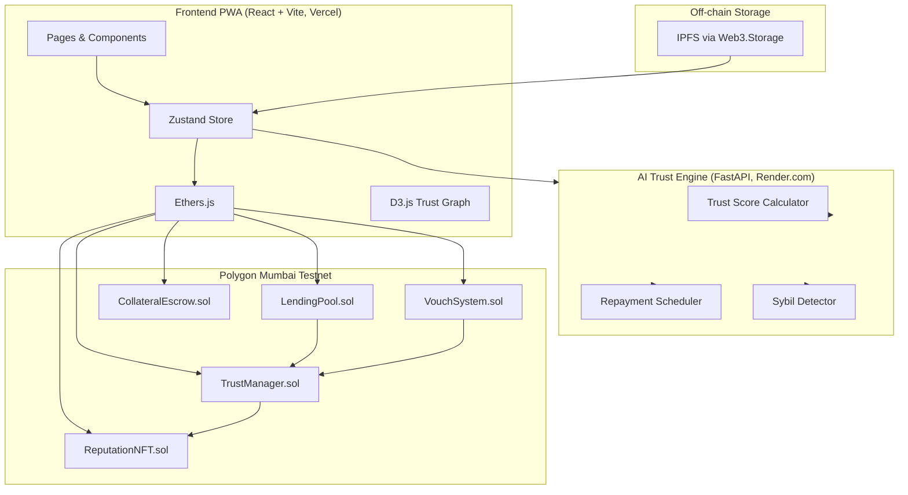
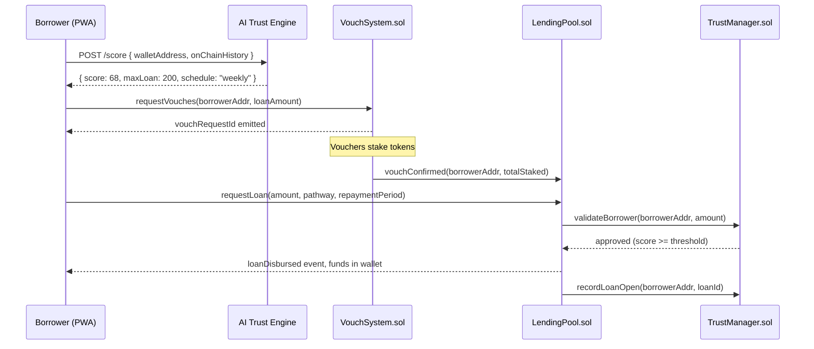
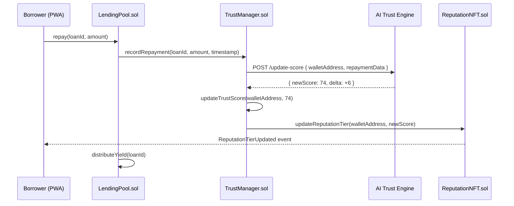
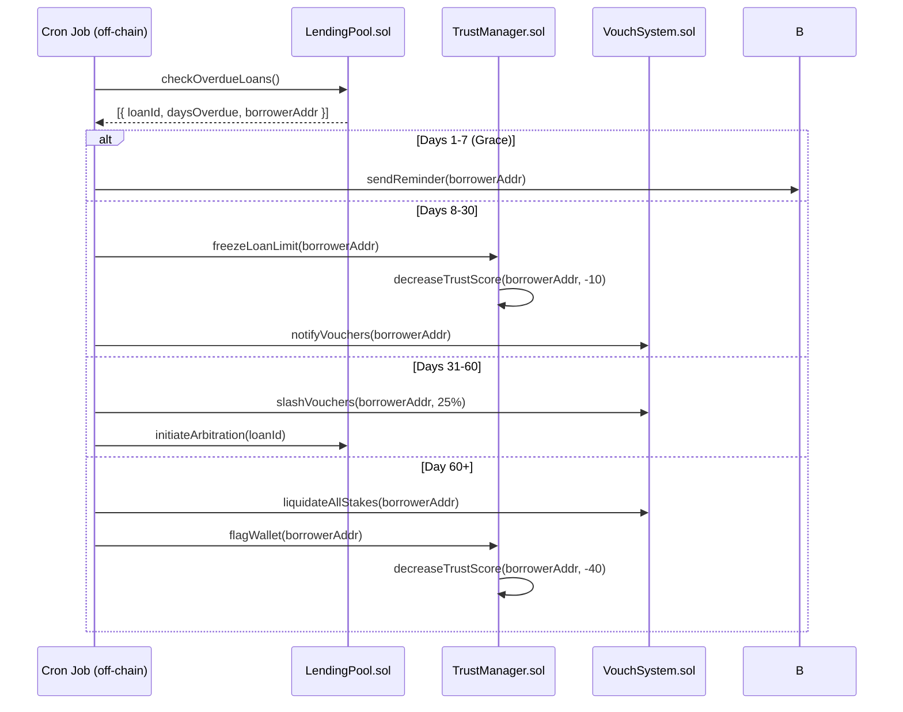

# Design Document: TrustLend Platform

## Overview

TrustLend is a decentralized, AI-governed micro-lending platform built on Polygon that enables secure borrowing and lending for individuals without access to formal banking. It replaces traditional credit systems with on-chain reputation, community trust (vouch networks), and adaptive AI risk scoring. The platform is delivered as a Progressive Web App (PWA) using React + Vite on the frontend, Solidity smart contracts on Polygon, and a Python-based AI Trust Engine served via FastAPI.

The existing codebase already contains a React + Vite frontend with mock UI screens (in `mockui/`) and functional page scaffolding in `src/pages/` and `src/components/`. The Zustand store in `src/store.js` manages wallet state, reputation scores, loan lifecycle, and lender portfolio. This design formalizes the full system architecture, smart contract interfaces, AI engine algorithms, and frontend data flows needed to make TrustLend production-ready.

The three core pillars of TrustLend are: (1) the AI Trust Engine that computes a 0–100 reputation score and enforces adaptive loan limits, (2) the Vouch System that enables community-backed collateral through staked social trust, and (3) the Lending Pool smart contract that holds lender deposits, disburses loans, and distributes yield — all governed by on-chain rules with no central authority.

## Architecture



## Sequence Diagrams

### Borrower Loan Request Flow



### Repayment & Trust Score Update Flow



### Default Escalation Flow



## Components and Interfaces

### Component 1: LendingPool.sol

**Purpose**: Holds lender deposits, disburses approved loans, collects repayments, and distributes yield proportionally to lenders.

**Interface**:
```solidity
interface ILendingPool {
    function deposit(uint256 amount) external;
    function withdraw(uint256 amount) external;
    function requestLoan(
        uint256 amount,
        LoanPathway pathway,
        uint256 repaymentPeriodDays
    ) external returns (bytes32 loanId);
    function repay(bytes32 loanId, uint256 amount) external;
    function getLoanStatus(bytes32 loanId) external view returns (LoanStatus);
    function getPoolLiquidity() external view returns (uint256);
    function getLenderYield(address lender) external view returns (uint256);

    event LoanDisbursed(bytes32 indexed loanId, address indexed borrower, uint256 amount);
    event RepaymentReceived(bytes32 indexed loanId, uint256 amount, uint256 timestamp);
    event YieldDistributed(uint256 totalYield, uint256 timestamp);
}

enum LoanPathway { VOUCH, COLLATERAL, TRUST_ONLY }
enum LoanStatus { PENDING, ACTIVE, REPAID, DEFAULTED, FROZEN }
```

**Responsibilities**:
- Maintain pool liquidity and lender share accounting (ERC-4626 vault pattern)
- Enforce loan limits returned by TrustManager before disbursement
- Collect repayments and route interest to yield distribution
- Emit on-chain events consumed by the frontend and AI engine

### Component 2: TrustManager.sol

**Purpose**: Single source of truth for borrower trust scores on-chain. Receives score updates from the AI engine (via oracle or authorized relayer), enforces loan eligibility, and maintains the score history.

**Interface**:
```solidity
interface ITrustManager {
    function getTrustScore(address wallet) external view returns (uint8 score);
    function getMaxLoanAmount(address wallet) external view returns (uint256 usdEquivalent);
    function updateTrustScore(address wallet, uint8 newScore) external; // onlyOracle
    function freezeLoanLimit(address wallet) external; // onlyPool
    function flagWallet(address wallet) external; // onlyPool
    function isFlagged(address wallet) external view returns (bool);

    event TrustScoreUpdated(address indexed wallet, uint8 oldScore, uint8 newScore);
    event WalletFlagged(address indexed wallet, uint256 timestamp);
}
```

**Responsibilities**:
- Map wallet addresses to trust scores (0–100)
- Compute max loan amount from score tier (enforced on-chain)
- Accept score updates only from the authorized AI oracle relayer
- Maintain flag status for defaulted wallets

### Component 3: VouchSystem.sol

**Purpose**: Manages the social collateral layer. Vouchers stake tokens against a borrower's loan. Handles vouch requests, confirmations, rewards, and slashing.

**Interface**:
```solidity
interface IVouchSystem {
    function requestVouch(address borrower, uint256 loanAmount) external returns (bytes32 requestId);
    function confirmVouch(bytes32 requestId, uint256 stakeAmount) external;
    function revokeVouch(bytes32 requestId) external;
    function slashVouchers(address borrower, uint8 slashPercent) external; // onlyPool
    function liquidateAllStakes(address borrower) external; // onlyPool
    function getVouchersFor(address borrower) external view returns (address[] memory);
    function getActiveVouchCount(address voucher) external view returns (uint8);

    event VouchConfirmed(address indexed voucher, address indexed borrower, uint256 stakeAmount);
    event VoucherSlashed(address indexed voucher, address indexed borrower, uint256 slashedAmount);
}
```

**Responsibilities**:
- Enforce minimum voucher reputation score (≥ 50) before allowing vouching
- Enforce max 4 simultaneous active vouches per voucher
- Distribute interest rewards to vouchers on successful repayment
- Slash stakes proportionally on default escalation

### Component 4: CollateralEscrow.sol

**Purpose**: Holds crypto collateral locked by borrowers choosing Pathway B. Auto-releases on full repayment; liquidates on default.

**Interface**:
```solidity
interface ICollateralEscrow {
    function lockCollateral(bytes32 loanId, uint256 amount) external payable;
    function releaseCollateral(bytes32 loanId) external; // onlyPool, on repayment
    function liquidateCollateral(bytes32 loanId) external; // onlyPool, on default
    function getLockedAmount(bytes32 loanId) external view returns (uint256);
}
```

### Component 5: ReputationNFT.sol

**Purpose**: Non-transferable (soulbound) NFT representing a borrower's reputation tier. Updated automatically when trust score crosses tier thresholds.

**Interface**:
```solidity
interface IReputationNFT {
    function mintOrUpdate(address wallet, uint8 score) external; // onlyTrustManager
    function getTier(address wallet) external view returns (ReputationTier);
    function tokenURI(uint256 tokenId) external view returns (string memory); // IPFS metadata

    event ReputationTierUpdated(address indexed wallet, ReputationTier oldTier, ReputationTier newTier);
}

enum ReputationTier { UNRANKED, BRONZE, SILVER, GOLD, PLATINUM, DIAMOND }
```

### Component 6: AI Trust Engine (FastAPI)

**Purpose**: Computes trust scores from on-chain data, generates adaptive repayment schedules, and detects Sybil attacks in the vouch network.

**Interface**:
```typescript
// POST /score
interface ScoreRequest {
  walletAddress: string
  repaymentHistory: RepaymentRecord[]
  voucherAddresses: string[]
  loanToRepaymentRatio: number
  transactionFrequency: number
}

interface ScoreResponse {
  score: number          // 0-100
  maxLoanUsd: number
  repaymentSchedule: "daily" | "weekly" | "seasonal"
  breakdown: ScoreBreakdown
  sybilRisk: "low" | "medium" | "high"
}

// POST /update-score  (called by on-chain oracle relayer)
interface UpdateScoreRequest {
  walletAddress: string
  repaymentData: { loanId: string; onTime: boolean; daysLate: number }
}

// GET /schedule/:walletAddress
interface ScheduleResponse {
  installments: { dueDate: string; amount: number }[]
  totalRepayment: number
  scheduleType: string
}
```

### Component 7: Frontend Store (Zustand)

**Purpose**: Client-side state management bridging the PWA UI, smart contracts (via Ethers.js), and AI engine API calls.

The existing `src/store.js` uses Zustand. It needs to be extended with:
- Wallet connection state (MetaMask / WalletConnect)
- Real trust score fetched from TrustManager.sol
- Active loan state synced from LendingPool.sol events
- Vouch network state from VouchSystem.sol
- AI score breakdown for the reputation dashboard

## Data Models

### LoanRecord

```typescript
interface LoanRecord {
  loanId: string            // bytes32 on-chain hash
  borrowerAddress: string   // wallet address
  amount: number            // USD equivalent at disbursement
  pathway: "vouch" | "collateral" | "trust_only"
  interestRateBps: number   // basis points (e.g. 420 = 4.2%)
  repaymentPeriodDays: number
  disbursedAt: number       // unix timestamp
  dueAt: number             // unix timestamp
  status: LoanStatus
  installments: Installment[]
  collateralLocked?: number // only for pathway B
  voucherAddresses?: string[] // only for pathway A
}

interface Installment {
  index: number
  amount: number
  dueDate: number           // unix timestamp
  paidAt?: number
  status: "pending" | "paid" | "overdue"
}
```

**Validation Rules**:
- `amount` must be within the borrower's current `maxLoanUsd` from TrustManager
- `pathway === "vouch"` requires `voucherAddresses.length >= 3` with combined stake ≥ `amount`
- `pathway === "collateral"` requires `collateralLocked >= amount * 1.5` (150% collateralization)
- `pathway === "trust_only"` requires `trustScore >= 30` and `amount <= 10` for new users

### TrustProfile

```typescript
interface TrustProfile {
  walletAddress: string
  score: number             // 0-100, stored on-chain in TrustManager
  tier: ReputationTier
  maxLoanUsd: number
  isFlagged: boolean
  breakdown: {
    repaymentHistory: number    // 0-30 (30% weight)
    repaymentSpeed: number      // 0-20 (20% weight)
    voucherQuality: number      // 0-15 (15% weight)
    loanToRepaymentRatio: number // 0-15 (15% weight)
    vouchNetworkBalance: number // 0-10 (10% weight)
    transactionFrequency: number // 0-10 (10% weight)
  }
  scoreHistory: { timestamp: number; score: number; delta: number }[]
  activeVouches: string[]       // wallets this user is vouching for
  vouchedBy: string[]           // wallets vouching for this user
}
```

### VouchRequest

```typescript
interface VouchRequest {
  requestId: string         // bytes32
  borrowerAddress: string
  loanAmount: number
  requiredVouchers: number  // always 3
  confirmedVouchers: VoucherStake[]
  status: "pending" | "fulfilled" | "expired" | "cancelled"
  expiresAt: number         // unix timestamp (72h window)
}

interface VoucherStake {
  voucherAddress: string
  stakedAmount: number
  confirmedAt: number
  rewardEarned?: number     // populated after repayment
  slashedAmount?: number    // populated after default
}
```

### LenderPosition

```typescript
interface LenderPosition {
  lenderAddress: string
  depositedAmount: number
  currentValue: number      // deposit + accrued yield
  shareOfPool: number       // percentage 0-100
  yieldEarned: number
  activeLoansCount: number
  depositedAt: number
  withdrawableAt: number    // when not locked in active loans
}
```

### RepaymentSchedule

```typescript
interface RepaymentSchedule {
  loanId: string
  scheduleType: "daily" | "weekly" | "seasonal"
  installments: Installment[]
  totalPrincipal: number
  totalInterest: number
  totalRepayment: number
  generatedBy: "ai_engine"  // always AI-generated
}
```

## Algorithmic Pseudocode

### Main Algorithm: AI Trust Score Computation

```pascal
ALGORITHM computeTrustScore(walletAddress)
INPUT: walletAddress of type String
OUTPUT: score of type Integer (0-100), breakdown of type ScoreBreakdown

BEGIN
  // Fetch on-chain data
  history ← fetchRepaymentHistory(walletAddress)
  vouchers ← fetchVoucherAddresses(walletAddress)
  txFrequency ← fetchTransactionFrequency(walletAddress)
  loanRatio ← fetchLoanToRepaymentRatio(walletAddress)

  ASSERT history IS NOT NULL
  ASSERT txFrequency >= 0

  // Component 1: Repayment History (30% weight)
  IF history.totalLoans = 0 THEN
    repaymentScore ← 0
  ELSE
    onTimeRate ← history.onTimeCount / history.totalLoans
    repaymentScore ← FLOOR(onTimeRate * 30)
  END IF

  // Component 2: Repayment Speed (20% weight)
  avgDaysEarly ← computeAverageDaysEarly(history)
  speedScore ← CLAMP(FLOOR(avgDaysEarly / 7 * 20), 0, 20)

  // Component 3: Voucher Quality (15% weight)
  IF vouchers.length = 0 THEN
    voucherScore ← 0
  ELSE
    avgVoucherScore ← MEAN(fetchTrustScore(v) FOR v IN vouchers)
    voucherScore ← FLOOR((avgVoucherScore / 100) * 15)
  END IF

  // Component 4: Loan-to-Repayment Ratio (15% weight)
  ratioScore ← CLAMP(FLOOR(loanRatio * 15), 0, 15)

  // Component 5: Vouch Network Balance (10% weight)
  vouchingFor ← fetchActiveVouchCount(walletAddress)
  vouchedByCount ← vouchers.length
  networkBalance ← vouchedByCount - vouchingFor
  networkScore ← CLAMP(FLOOR((networkBalance + 4) / 8 * 10), 0, 10)

  // Component 6: Transaction Frequency (10% weight)
  freqScore ← CLAMP(FLOOR(txFrequency / 30 * 10), 0, 10)

  // Aggregate
  totalScore ← repaymentScore + speedScore + voucherScore + ratioScore + networkScore + freqScore

  ASSERT totalScore >= 0 AND totalScore <= 100

  RETURN {
    score: totalScore,
    breakdown: {
      repaymentHistory: repaymentScore,
      repaymentSpeed: speedScore,
      voucherQuality: voucherScore,
      loanToRepaymentRatio: ratioScore,
      vouchNetworkBalance: networkScore,
      transactionFrequency: freqScore
    }
  }
END
```

**Preconditions:**
- `walletAddress` is a valid Ethereum address
- On-chain data sources are accessible
- All component weights sum to 100

**Postconditions:**
- `score` is in range [0, 100]
- `breakdown` components sum to `score`
- Score is deterministic for the same on-chain state

**Loop Invariants:**
- For voucher quality loop: all previously fetched voucher scores are valid integers in [0, 100]

---

### Algorithm: Adaptive Repayment Scheduling

```pascal
ALGORITHM generateRepaymentSchedule(loanAmount, interestRateBps, borrowerProfile)
INPUT: loanAmount (USD), interestRateBps (integer), borrowerProfile
OUTPUT: schedule of type RepaymentSchedule

BEGIN
  totalInterest ← loanAmount * (interestRateBps / 10000)
  totalRepayment ← loanAmount + totalInterest

  // Determine schedule type from borrower income pattern
  IF borrowerProfile.incomePattern = "daily" THEN
    scheduleType ← "daily"
    installmentCount ← loanAmount * 2  // 2x loan amount in days
    installmentAmount ← totalRepayment / installmentCount
  ELSE IF borrowerProfile.incomePattern = "weekly" THEN
    scheduleType ← "weekly"
    installmentCount ← CEIL(loanAmount / 10)  // ~$10 per week
    installmentAmount ← totalRepayment / installmentCount
  ELSE  // seasonal
    scheduleType ← "seasonal"
    installmentCount ← 1
    installmentAmount ← totalRepayment
    gracePeriodDays ← borrowerProfile.nextHarvestDays
  END IF

  // Build installment list
  installments ← []
  currentDate ← NOW()

  FOR i FROM 1 TO installmentCount DO
    ASSERT installmentAmount > 0
    ASSERT currentDate > NOW()  // loop invariant: dates always in future

    IF scheduleType = "daily" THEN
      dueDate ← currentDate + i DAYS
    ELSE IF scheduleType = "weekly" THEN
      dueDate ← currentDate + (i * 7) DAYS
    ELSE
      dueDate ← currentDate + gracePeriodDays DAYS
    END IF

    installments.append({
      index: i,
      amount: installmentAmount,
      dueDate: dueDate,
      status: "pending"
    })
  END FOR

  ASSERT SUM(inst.amount FOR inst IN installments) = totalRepayment

  RETURN {
    scheduleType: scheduleType,
    installments: installments,
    totalPrincipal: loanAmount,
    totalInterest: totalInterest,
    totalRepayment: totalRepayment
  }
END
```

**Preconditions:**
- `loanAmount > 0`
- `interestRateBps >= 0`
- `borrowerProfile.incomePattern` is one of "daily", "weekly", "seasonal"

**Postconditions:**
- Sum of all installment amounts equals `totalRepayment`
- All due dates are in the future relative to disbursement
- `installments.length >= 1`

**Loop Invariants:**
- All previously generated installments have valid future due dates
- Running sum of installment amounts ≤ `totalRepayment`

---

### Algorithm: Sybil Attack Detection

```pascal
ALGORITHM detectSybilRisk(walletAddress, voucherAddresses)
INPUT: walletAddress, voucherAddresses (list of addresses)
OUTPUT: riskLevel of type Enum { LOW, MEDIUM, HIGH }

BEGIN
  riskScore ← 0

  // Check 1: Circular vouching (A vouches B, B vouches A)
  FOR each voucher IN voucherAddresses DO
    voucherVouches ← fetchVoucherAddresses(voucher)
    IF walletAddress IN voucherVouches THEN
      riskScore ← riskScore + 30
    END IF
  END FOR

  // Check 2: Voucher age (new accounts vouching new accounts)
  FOR each voucher IN voucherAddresses DO
    accountAgeDays ← fetchAccountAge(voucher)
    IF accountAgeDays < 7 THEN
      riskScore ← riskScore + 20
    END IF
  END FOR

  // Check 3: Voucher cluster (all vouchers share same IP or creation block)
  creationBlocks ← [fetchCreationBlock(v) FOR v IN voucherAddresses]
  IF MAX(creationBlocks) - MIN(creationBlocks) < 100 THEN
    riskScore ← riskScore + 25
  END IF

  // Check 4: Over-vouching (voucher already at max 4 active vouches)
  FOR each voucher IN voucherAddresses DO
    activeVouches ← fetchActiveVouchCount(voucher)
    IF activeVouches >= 4 THEN
      riskScore ← riskScore + 15
    END IF
  END FOR

  IF riskScore >= 50 THEN
    RETURN HIGH
  ELSE IF riskScore >= 25 THEN
    RETURN MEDIUM
  ELSE
    RETURN LOW
  END IF
END
```

**Preconditions:**
- `voucherAddresses.length >= 1`
- On-chain account data is accessible

**Postconditions:**
- Returns exactly one of LOW, MEDIUM, HIGH
- HIGH risk triggers manual review flag in AI engine response

---

### Algorithm: Default Escalation Handler

```pascal
ALGORITHM handleDefaultEscalation(loanId, daysOverdue)
INPUT: loanId, daysOverdue (integer)
OUTPUT: escalationAction of type EscalationAction

BEGIN
  loan ← fetchLoan(loanId)
  ASSERT loan.status = ACTIVE OR loan.status = FROZEN

  IF daysOverdue >= 1 AND daysOverdue <= 7 THEN
    // Grace period
    sendAutomatedReminder(loan.borrowerAddress)
    RETURN { action: "REMINDER", slashPercent: 0 }

  ELSE IF daysOverdue >= 8 AND daysOverdue <= 30 THEN
    // Freeze and notify
    TrustManager.freezeLoanLimit(loan.borrowerAddress)
    TrustManager.decreaseTrustScore(loan.borrowerAddress, 10)
    VouchSystem.notifyVouchers(loan.borrowerAddress)
    RETURN { action: "FREEZE", slashPercent: 0 }

  ELSE IF daysOverdue >= 31 AND daysOverdue <= 60 THEN
    // Incremental slashing (25% per 10-day window)
    slashWindow ← FLOOR((daysOverdue - 31) / 10)
    slashPercent ← MIN(slashWindow * 25, 75)
    VouchSystem.slashVouchers(loan.borrowerAddress, slashPercent)
    initiateArbitration(loanId)
    RETURN { action: "SLASH", slashPercent: slashPercent }

  ELSE  // daysOverdue > 60
    // Full default
    VouchSystem.liquidateAllStakes(loan.borrowerAddress)
    TrustManager.flagWallet(loan.borrowerAddress)
    TrustManager.decreaseTrustScore(loan.borrowerAddress, 40)
    LendingPool.markDefaulted(loanId)
    RETURN { action: "DEFAULT", slashPercent: 100 }
  END IF
END
```

**Preconditions:**
- `daysOverdue >= 1`
- `loanId` references an existing active or frozen loan

**Postconditions:**
- Exactly one escalation action is taken per invocation
- Trust score never drops below 0
- Slash percent is in range [0, 100]

## Key Functions with Formal Specifications

### LendingPool.requestLoan()

```solidity
function requestLoan(
    uint256 amount,
    LoanPathway pathway,
    uint256 repaymentPeriodDays
) external returns (bytes32 loanId)
```

**Preconditions:**
- `msg.sender` is not flagged in TrustManager
- `amount > 0` and `amount <= TrustManager.getMaxLoanAmount(msg.sender)`
- `repaymentPeriodDays` is in range [7, 365]
- If `pathway == VOUCH`: VouchSystem has ≥ 3 confirmed vouchers with combined stake ≥ `amount`
- If `pathway == COLLATERAL`: CollateralEscrow has locked ≥ `amount * 1.5`
- If `pathway == TRUST_ONLY`: `TrustManager.getTrustScore(msg.sender) >= 30`
- Pool has sufficient liquidity: `getPoolLiquidity() >= amount`

**Postconditions:**
- `loanId` is a unique bytes32 identifier
- `amount` is transferred from pool to `msg.sender`
- `LoanDisbursed` event is emitted
- `TrustManager.recordLoanOpen()` is called
- Pool liquidity decreases by `amount`

**Loop Invariants:** N/A (no loops)

---

### TrustManager.updateTrustScore()

```solidity
function updateTrustScore(address wallet, uint8 newScore) external onlyOracle
```

**Preconditions:**
- `msg.sender` is the authorized AI oracle relayer address
- `wallet` is a valid non-zero address
- `newScore` is in range [0, 100]

**Postconditions:**
- `getTrustScore(wallet)` returns `newScore`
- `TrustScoreUpdated` event is emitted with old and new score
- If `newScore` crosses a tier boundary, `ReputationNFT.mintOrUpdate()` is called
- `getMaxLoanAmount(wallet)` reflects the new tier limits

**Loop Invariants:** N/A

---

### VouchSystem.confirmVouch()

```solidity
function confirmVouch(bytes32 requestId, uint256 stakeAmount) external
```

**Preconditions:**
- `requestId` references a pending vouch request
- `TrustManager.getTrustScore(msg.sender) >= 50`
- `getActiveVouchCount(msg.sender) < 4`
- `stakeAmount > 0`
- `msg.sender` has approved `stakeAmount` tokens to VouchSystem
- Vouch request has not expired

**Postconditions:**
- `stakeAmount` tokens are transferred from `msg.sender` to VouchSystem escrow
- `VouchConfirmed` event is emitted
- `getActiveVouchCount(msg.sender)` increases by 1
- If total confirmed stakes ≥ loan amount, vouch request status becomes "fulfilled"

**Loop Invariants:** N/A

---

### AI Engine: computeTrustScore() (Python/FastAPI)

```python
def compute_trust_score(wallet_address: str, on_chain_data: OnChainData) -> ScoreResponse:
```

**Preconditions:**
- `wallet_address` matches regex `^0x[a-fA-F0-9]{40}$`
- `on_chain_data.repayment_history` is a list (may be empty for new users)
- All voucher addresses in `on_chain_data.voucher_addresses` are valid

**Postconditions:**
- `response.score` is an integer in [0, 100]
- `sum(response.breakdown.values()) == response.score`
- `response.max_loan_usd` matches the tier table for `response.score`
- `response.sybil_risk` is one of "low", "medium", "high"

**Loop Invariants:**
- For each voucher score fetch: accumulated `voucher_quality_score` ≤ 15

---

### Frontend: useLoanRequest() hook

```typescript
async function useLoanRequest(
  amount: number,
  pathway: LoanPathway,
  repaymentDays: number
): Promise<{ loanId: string; txHash: string }>
```

**Preconditions:**
- Wallet is connected (`store.user.walletConnected === true`)
- `amount <= store.user.borrowLimit`
- AI score has been fetched and is current (< 5 minutes old)

**Postconditions:**
- Returns `loanId` and `txHash` on success
- `store.activeLoan` is updated with the new loan
- `store.user.balanceUsd` increases by `amount`
- On failure, throws typed `LoanRequestError` with reason code

## Example Usage

### Borrower: Full Loan Request (TypeScript / Ethers.js)

```typescript
// 1. Connect wallet and fetch trust score
const provider = new ethers.BrowserProvider(window.ethereum)
const signer = await provider.getSigner()
const walletAddress = await signer.getAddress()

const scoreRes = await fetch(`${AI_ENGINE_URL}/score`, {
  method: "POST",
  body: JSON.stringify({ walletAddress, onChainHistory: [] })
})
const { score, maxLoanUsd, repaymentSchedule } = await scoreRes.json()
// score: 68, maxLoanUsd: 200, repaymentSchedule: "weekly"

// 2. Request vouches (Pathway A)
const vouchSystem = new ethers.Contract(VOUCH_SYSTEM_ADDR, VouchSystemABI, signer)
const requestId = await vouchSystem.requestVouch(walletAddress, ethers.parseUnits("75", 6))
// Vouchers confirm off-chain via notification, then call confirmVouch()

// 3. Request loan once vouches are fulfilled
const lendingPool = new ethers.Contract(LENDING_POOL_ADDR, LendingPoolABI, signer)
const tx = await lendingPool.requestLoan(
  ethers.parseUnits("75", 6),  // $75 USDC
  0,                            // LoanPathway.VOUCH
  42                            // 42 days
)
const receipt = await tx.wait()
const loanId = receipt.logs[0].topics[1]  // LoanDisbursed event

// 4. Make a repayment
const usdc = new ethers.Contract(USDC_ADDR, ERC20ABI, signer)
await usdc.approve(LENDING_POOL_ADDR, ethers.parseUnits("13.12", 6))
await lendingPool.repay(loanId, ethers.parseUnits("13.12", 6))
```

### Lender: Deposit and Earn Yield

```typescript
// Deposit $500 USDC into lending pool
const usdc = new ethers.Contract(USDC_ADDR, ERC20ABI, signer)
await usdc.approve(LENDING_POOL_ADDR, ethers.parseUnits("500", 6))

const lendingPool = new ethers.Contract(LENDING_POOL_ADDR, LendingPoolABI, signer)
await lendingPool.deposit(ethers.parseUnits("500", 6))

// Check accrued yield
const yield_ = await lendingPool.getLenderYield(walletAddress)
console.log(`Yield earned: $${ethers.formatUnits(yield_, 6)}`)

// Withdraw when not locked
await lendingPool.withdraw(ethers.parseUnits("500", 6))
```

### AI Engine: Score Computation (Python)

```python
import requests

response = requests.post("https://trustlend-ai.render.com/score", json={
    "wallet_address": "0xabc...123",
    "repayment_history": [
        {"loan_id": "0x001", "on_time": True, "days_late": 0},
        {"loan_id": "0x002", "on_time": True, "days_late": 0},
        {"loan_id": "0x003", "on_time": False, "days_late": 4},
    ],
    "voucher_addresses": ["0xvoucher1", "0xvoucher2", "0xvoucher3"],
    "loan_to_repayment_ratio": 0.85,
    "transaction_frequency": 22
})

data = response.json()
# { "score": 68, "max_loan_usd": 200, "repayment_schedule": "weekly",
#   "breakdown": { "repayment_history": 20, "repayment_speed": 14, ... },
#   "sybil_risk": "low" }
```

### Voucher: Stake and Earn Reward

```typescript
// Voucher confirms a vouch request
const vouchSystem = new ethers.Contract(VOUCH_SYSTEM_ADDR, VouchSystemABI, signer)

// Approve stake amount
const usdc = new ethers.Contract(USDC_ADDR, ERC20ABI, signer)
await usdc.approve(VOUCH_SYSTEM_ADDR, ethers.parseUnits("25", 6))

// Confirm vouch (stakes $25 on behalf of borrower)
await vouchSystem.confirmVouch(requestId, ethers.parseUnits("25", 6))

// After borrower repays, voucher earns proportional interest
// Automatically distributed by LendingPool on repayment
```

## Correctness Properties

### Trust Score Properties

- **Bounded Score**: For all wallets `w`, `0 <= getTrustScore(w) <= 100` at all times
- **Score Decomposition**: For all wallets `w`, `sum(breakdown(w).values()) == getTrustScore(w)`
- **Monotonic Improvement**: For all wallets `w`, if `w` makes `n` consecutive on-time repayments, `getTrustScore(w)` after `n` repayments `>= getTrustScore(w)` before
- **Default Penalty**: For all wallets `w` that reach full default (day 60+), `getTrustScore(w)` decreases by exactly 40 points (clamped to 0)
- **Tier Consistency**: For all wallets `w`, `getMaxLoanAmount(w)` is exactly the tier limit corresponding to `getTrustScore(w)` per the tier table

### Loan Lifecycle Properties

- **Disbursement Integrity**: For all loans `l`, `l.amount` transferred to borrower equals `l.amount` deducted from pool liquidity
- **Repayment Completeness**: For all loans `l`, if `sum(l.installments.paid) >= l.totalRepayment`, then `l.status == REPAID`
- **No Over-Borrowing**: For all wallets `w`, at any point in time, `sum(active loans for w) <= TrustManager.getMaxLoanAmount(w)`
- **Pathway Enforcement**: For all loans `l` with `pathway == VOUCH`, `l` cannot be disbursed unless `VouchSystem.getVouchersFor(l.borrower).length >= 3`

### Vouch System Properties

- **Voucher Eligibility**: For all vouchers `v`, `confirmVouch()` succeeds only if `getTrustScore(v) >= 50`
- **Max Active Vouches**: For all vouchers `v`, `getActiveVouchCount(v) <= 4` at all times
- **Slash Proportionality**: For all defaults with `n` vouchers, each voucher `i` is slashed proportionally to `stake_i / totalStake`
- **No Self-Vouching**: For all wallets `w`, `w` cannot appear in `getVouchersFor(w)`
- **Circular Vouch Detection**: Sybil detector flags any pair `(A, B)` where `A` vouches `B` and `B` vouches `A`

### Lending Pool Properties

- **Solvency**: At all times, `pool.totalDeposits >= pool.totalActiveLoanValue + pool.reserveBuffer`
- **Yield Proportionality**: For all lenders `l`, `l.yieldEarned / totalYieldDistributed == l.shareOfPool`
- **Withdrawal Safety**: `withdraw(amount)` succeeds only if `amount <= lender.depositedAmount` and `pool.availableLiquidity >= amount`

### AI Engine Properties

- **Determinism**: For the same on-chain state, `computeTrustScore(w)` always returns the same score
- **Sybil Sensitivity**: If `detectSybilRisk(w, vouchers)` returns HIGH, the loan request is flagged for manual review and not auto-approved
- **Schedule Completeness**: For all schedules `s`, `sum(s.installments.amount) == s.totalRepayment`

## Error Handling

### Error Scenario 1: Insufficient Pool Liquidity

**Condition**: Borrower requests a loan but `getPoolLiquidity() < amount`
**Response**: `LendingPool.requestLoan()` reverts with `InsufficientLiquidity(uint256 available, uint256 requested)`. Frontend displays "Pool temporarily at capacity — try a smaller amount or check back later."
**Recovery**: Lenders can deposit to restore liquidity. Borrower request is not recorded on-chain.

### Error Scenario 2: Vouch Request Expiry

**Condition**: A vouch request does not collect 3 confirmed vouchers within 72 hours
**Response**: VouchSystem marks request as "expired". Staked tokens from partial vouchers are returned. Borrower is notified via frontend event listener.
**Recovery**: Borrower can create a new vouch request. Partial vouchers are not penalized.

### Error Scenario 3: AI Engine Unavailability

**Condition**: FastAPI service on Render.com is unreachable (timeout > 5s)
**Response**: Frontend falls back to the last cached score (stored in localStorage with timestamp). If cache is > 24h old, loan requests are blocked with message "Score verification temporarily unavailable."
**Recovery**: Retry with exponential backoff (1s, 2s, 4s, max 3 retries). Alert shown in UI.

### Error Scenario 4: Oracle Relayer Failure

**Condition**: The AI oracle relayer fails to submit score updates to TrustManager.sol
**Response**: Score updates are queued off-chain. On-chain score remains stale. Loan limits are not updated until the next successful oracle submission.
**Recovery**: Relayer retries with a dead-letter queue. Stale scores are flagged in the UI with a "Score pending update" indicator.

### Error Scenario 5: Wallet Disconnection Mid-Transaction

**Condition**: User disconnects wallet after signing but before transaction confirmation
**Response**: Ethers.js throws `TransactionReplaced` or `UserRejected`. Frontend catches the error, shows a toast notification, and does not update local state.
**Recovery**: User can reconnect wallet and retry. No on-chain state is changed for unsigned transactions.

### Error Scenario 6: Collateral Liquidation Race Condition

**Condition**: Two transactions attempt to liquidate the same collateral simultaneously
**Response**: CollateralEscrow uses a `nonReentrant` modifier (OpenZeppelin ReentrancyGuard). Second call reverts with `CollateralAlreadyLiquidated`.
**Recovery**: No double-liquidation possible. First successful call wins.

## Testing Strategy

### Unit Testing Approach

Smart contracts are tested with Hardhat + Chai. Each contract function is tested in isolation with mocked dependencies.

Key unit test cases:
- `LendingPool`: loan disbursement with each pathway, repayment flow, yield distribution math, liquidity checks
- `TrustManager`: score update authorization (only oracle), tier boundary transitions, flag/freeze state
- `VouchSystem`: voucher eligibility enforcement, max vouch count, stake slashing proportionality
- `CollateralEscrow`: lock/release/liquidate with reentrancy protection
- AI Engine (pytest): score computation for edge cases (0 loans, all defaults, max score), schedule generation for each income type, Sybil detection thresholds

### Property-Based Testing Approach

**Property Test Library**: fast-check (frontend/TypeScript), Hypothesis (Python/AI engine)

Key property tests:

```typescript
// fast-check: Trust score always in [0, 100]
fc.assert(fc.property(
  fc.record({ repayments: fc.array(fc.boolean()), voucherScores: fc.array(fc.integer(0, 100)) }),
  (data) => {
    const score = computeTrustScore(data)
    return score >= 0 && score <= 100
  }
))

// fast-check: Repayment schedule installments always sum to totalRepayment
fc.assert(fc.property(
  fc.record({ amount: fc.float(5, 500), rateBps: fc.integer(100, 2000) }),
  (data) => {
    const schedule = generateSchedule(data.amount, data.rateBps, "weekly")
    const sum = schedule.installments.reduce((a, i) => a + i.amount, 0)
    return Math.abs(sum - schedule.totalRepayment) < 0.01  // float tolerance
  }
))
```

```python
# Hypothesis: Score decomposition invariant
@given(
    repayment_history=st.lists(st.booleans(), min_size=0, max_size=50),
    voucher_scores=st.lists(st.integers(0, 100), min_size=0, max_size=4)
)
def test_score_decomposition(repayment_history, voucher_scores):
    result = compute_trust_score_from_data(repayment_history, voucher_scores)
    assert sum(result["breakdown"].values()) == result["score"]
    assert 0 <= result["score"] <= 100
```

### Integration Testing Approach

- Deploy all contracts to Hardhat local network (or Polygon Mumbai fork)
- Run full borrower flow: wallet connect → score fetch → vouch request → loan disbursement → repayment → score update
- Run full lender flow: deposit → loan funded → yield distributed → withdrawal
- Run default escalation flow: loan created → days advanced → each escalation stage verified
- Frontend integration: mock AI engine responses, test Ethers.js contract interactions with Hardhat node
- E2E with Playwright: onboarding screen → borrow flow → repayment screen

## Performance Considerations

- **Gas Optimization**: TrustManager stores scores as `uint8` (1 byte) to minimize storage costs. Batch score updates via a single oracle transaction where possible. Use events for historical data rather than on-chain arrays.
- **AI Engine Latency**: Score computation target is < 500ms. XGBoost model is pre-loaded at startup. On-chain data is fetched in parallel using `asyncio.gather()`. Results are cached per wallet for 5 minutes.
- **Frontend Bundle**: The D3.js trust network graph is lazy-loaded only on the `/network` route. Ethers.js is tree-shaken. PWA service worker caches static assets for offline-first experience.
- **Pool Throughput**: LendingPool uses a share-based accounting model (ERC-4626) to avoid per-lender loops during yield distribution. Yield is accumulated as a global rate and claimed lazily on withdrawal.
- **Polygon Throughput**: Polygon Mumbai supports ~7,000 TPS. At expected scale (thousands of micro-loans), gas costs per transaction are < $0.01. No L2 batching needed at MVP scale.

## Security Considerations

- **Reentrancy**: All state-changing functions in LendingPool and CollateralEscrow use OpenZeppelin `ReentrancyGuard`. Checks-Effects-Interactions pattern enforced throughout.
- **Oracle Trust**: Only a single authorized relayer address can call `TrustManager.updateTrustScore()`. The relayer key is stored in a hardware wallet / AWS KMS. A multi-sig upgrade path is planned for production.
- **Sybil Resistance**: The AI Sybil detector runs on every loan request. High-risk requests are blocked from auto-approval. Voucher minimum score (50) and max active vouches (4) are enforced on-chain, not just off-chain.
- **Flash Loan Attacks**: LendingPool uses a `loanInProgress` mutex per borrower to prevent same-block borrow-repay cycles that could game the trust score.
- **Front-Running**: Loan requests include a `deadline` parameter. Transactions submitted after the deadline revert, preventing MEV bots from sandwiching loan disbursements.
- **Private Key Management**: No private keys are stored in the frontend. All signing is done via MetaMask / WalletConnect. The AI oracle relayer key is never exposed to the frontend.
- **Input Validation**: All smart contract inputs are validated with explicit require statements. AI engine inputs are validated with Pydantic models before processing.

## Dependencies

| Layer | Dependency | Version | Purpose |
|-------|-----------|---------|---------|
| Blockchain | Solidity | ^0.8.20 | Smart contract language |
| Blockchain | Hardhat | ^2.19 | Development & testing framework |
| Blockchain | OpenZeppelin Contracts | ^5.0 | ReentrancyGuard, ERC-4626, ERC-721 |
| Blockchain | Ethers.js | ^6.9 | Frontend contract interaction |
| AI Engine | FastAPI | ^0.109 | REST API server |
| AI Engine | Scikit-learn | ^1.4 | ML model training |
| AI Engine | XGBoost | ^2.0 | Trust score prediction model |
| AI Engine | Pandas | ^2.1 | On-chain data processing |
| AI Engine | Pydantic | ^2.5 | Request/response validation |
| Frontend | React | ^18.2 | UI framework |
| Frontend | Vite | ^5.0 | Build tool |
| Frontend | Zustand | ^4.4 | State management |
| Frontend | Framer Motion | ^10.16 | Animations |
| Frontend | D3.js | ^7.8 | Trust network graph |
| Frontend | Tailwind CSS | ^3.4 | Styling |
| Storage | Web3.Storage | latest | IPFS pinning for NFT metadata |
| Deployment | Vercel | — | Frontend hosting |
| Deployment | Render.com | — | AI engine hosting |
